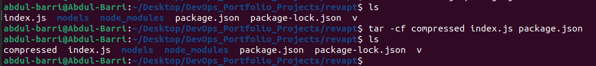
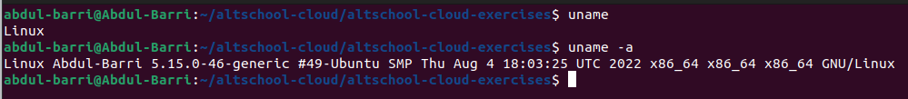
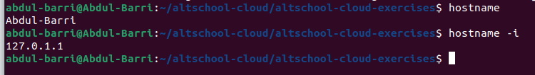
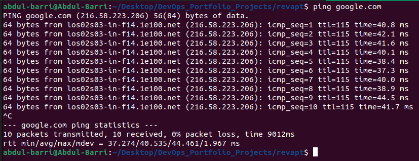
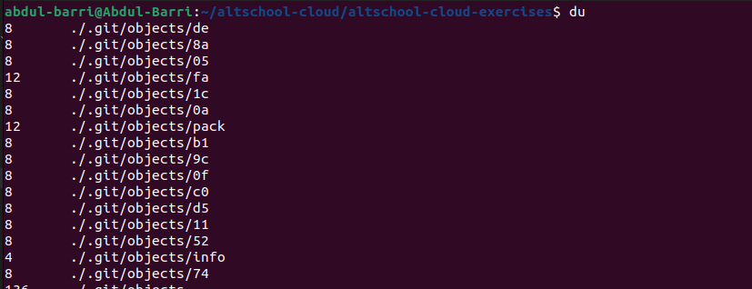
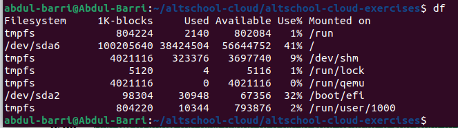
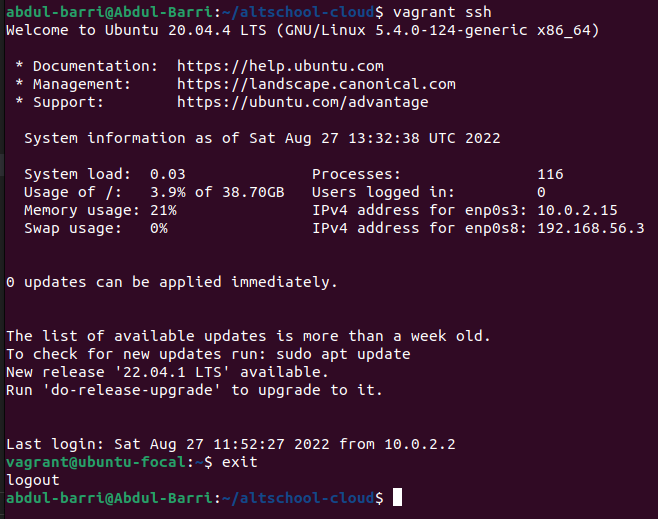
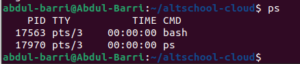
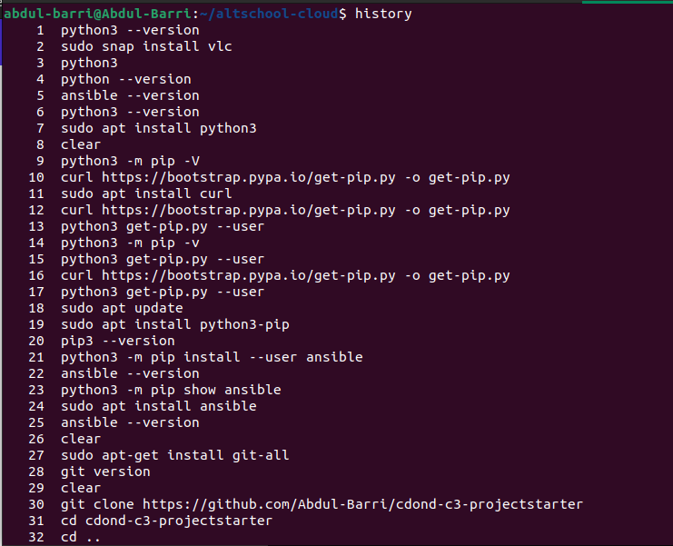
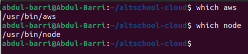

1. `tar` - Use `tar` to work with tarballs (or files compressed in a tarball archive) in the Linux command line. It has a long list of uses. It can be used to compress and uncompress different types of tar archives like .tar, .tar.gz, .tar.bz2,etc. It works on the basis of the arguments given to it. For example, "tar -cvf" for creating a .tar archive, -xvf to untar a tar archive, -tvf to list the contents of the archive, etc. An example of using `tar` command is given below;

2. `uname` - Use `uname` to show the information about the system your Linux distro is running. Using the command `uname -a` prints most of the information about the system. This prints the kernel release date, version, processor type, etc. An example of using `uname` command is given below;

3. `hostname` - Use `hostname` to know your name in your host or network. Basically, it displays your hostname and IP address. Just typing `hostname` gives the output. Typing in `hostname -I` gives you your IP address in your network. An example of using `hostname` command is given below;

4. `ping` - Use `ping` to check your connection to a server. Wikipedia says, "Ping is a computer network administration software utility used to test the reachability of a host on an Internet Protocol (IP) network". Simply, when you type in, for example, `ping google.com`, it checks if it can connect to the server and come back. It measures this round-trip time and gives you the details about it. The use of this command for simple users like us is to check your internet connection. If it pings the Google server (in this case), you can confirm that your internet connection is active! An example of using `ping` command is given below;

5. `du` - Use `du` to know the disk usage of a file in your system. If you want to know the disk usage for a particular folder or file in Linux, you can type in the command `df` and the name of the folder or file. For example, if you want to know the disk space used by the documents folder in Linux, you can use the command “du Documents”. You can also use the command `ls -lah` to view the file sizes of all the files in a folder. An example of using `du` command is given below;

6. `df` - Use the `df` command to see the available disk space in each of the partitions in your system. You can just type in `df` in the command line and you can see each mounted partition and their used/available space in % and in KBs. If you want it shown in megabytes, you can use the command `df -m`. An example of using `df` command is given below;

7. `exit` - The `exit` command does exactly what its name suggests. With it, you can end a shell session and, in most cases, automatically close the terminal you’re using. An example of using `exit` command is given below;

8. `ps` - With `ps`, you can take a look at the processes your current shell session is running. It prints useful information about the programs you’re running, like process ID, TTY (TeleTYpewriter), time, and command name. An example of using `ps` command is given below;

9. `history` - This command displays an enumerated list with the commands you’ve used in the past. An example of using `history` command is given below;

10. `which` - The `which` command outputs the full path of shell commands. If it can’t recognize the given command, it’ll throw an error. An example of using `which` command is given below;

