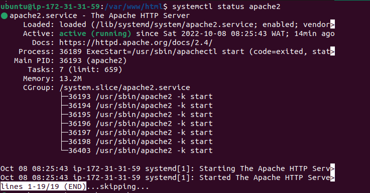

- Output of `systemctl status apache2`:

        ● apache2.service - The Apache HTTP Server
             Loaded: loaded (/lib/systemd/system/apache2.service; enabled; vendor>
             Active: active (running) since Sat 2022-10-08 08:25:43 WAT; 14min ago
               Docs: https://httpd.apache.org/docs/2.4/
            Process: 36189 ExecStart=/usr/sbin/apachectl start (code=exited, stat>
           Main PID: 36193 (apache2)
              Tasks: 7 (limit: 659)
             Memory: 13.2M
             CGroup: /system.slice/apache2.service
                     ├─36193 /usr/sbin/apache2 -k start
                     ├─36194 /usr/sbin/apache2 -k start
                     ├─36195 /usr/sbin/apache2 -k start
                     ├─36196 /usr/sbin/apache2 -k start
                     ├─36197 /usr/sbin/apache2 -k start
                     ├─36198 /usr/sbin/apache2 -k start
                     └─36403 /usr/sbin/apache2 -k start

        Oct 08 08:25:43 ip-172-31-31-59 systemd[1]: Starting The Apache HTTP Serv>
        Oct 08 08:25:43 ip-172-31-31-59 systemd[1]: Started The Apache HTTP Serve>
        lines 1-19/19 (END)...skipping...

